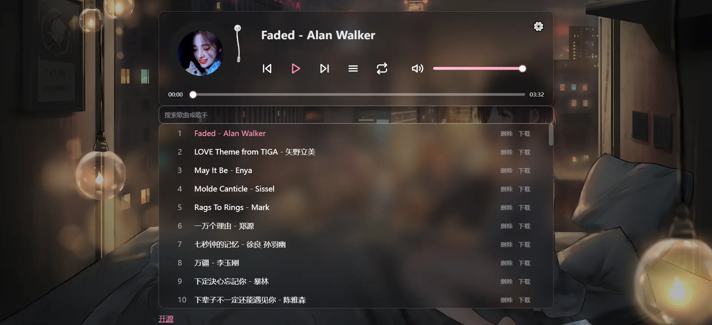

# 🎵 Music Player

## 一个简约音乐播放器，支持在线播放，歌单管理等功能，采用 React + Vite 构建，支持多平台部署

<p align="center">
  
</p>

  <a href="https://reactjs.org/">
    
  </a>
  <a href="https://vitejs.dev/">
    
  </a>
  <a href="https://www.javascript.com/">
    
  </a>
  <a href="https://pages.cloudflare.com/">
    
  </a>
  <a href="https://vercel.com/">
    
  </a>
  <a href="https://pages.edgeone.ai/">
    
  </a>
  <a href="https://hub.docker.com/r/zxlwq/music">
    
  </a>
</p>



---

# 技术栈

- **前端框架** - React
- **构建工具** - Vite
- **样式** - 原生 CSS

# 📁 项目目录结构

```
music/
├── .dockerignore              # Docker 构建忽略
├── .edgeignore                # EdgeOne 部署忽略
├── .gitignore                 # Git 忽略规则
├── .prettierignore            # Prettier 忽略路径
├── .prettierrc                # Prettier 格式化配置
├── .stylelintrc.json          # Stylelint 规则
├── .vercelignore              # Vercel 部署忽略
├── Dockerfile                 # 容器镜像构建
├── docker-compose.yml         # Docker Compose 编排（可选）
├── env.example                # 环境变量示例
├── eslint.config.js           # ESLint 扁平配置（src / api / lib 等）
├── tsconfig.base.json         # tsc 共用 compilerOptions（供 extends）
├── tsconfig.json              # 前端 src：`checkJs`，宽松 strict（IDE / `npm run typecheck`）
├── tsconfig.lib.json          # `lib/`：strict + noImplicitAny（JSDoc；第二条 typecheck）
├── vite.config.js             # Vite 构建配置
├── vercel.json                # Vercel 路由与 Functions 配置
├── edgeone.json               # EdgeOne 相关配置
├── r2-cors.json               # R2 CORS 参考配置
├── package.json               # 依赖与 npm 脚本
├── package-lock.json          # 锁定依赖版本
├── index.html                 # SPA 入口 HTML
├── server.js                  # Node 一体化后端（本地 npm start / Docker）
├── GIT_URL.js                 # Git 代理相关脚本
├── music.py                   # 辅助脚本
├── README.md                  # 项目说明
├── LICENSE                    # 开源许可证（MIT）
├── music.webp / zxlwq.webp    # 文档配图
│
├── .github/workflows/         # GitHub Actions
│   ├── docker.yml             # 构建 / 推送 Docker 镜像
│   ├── music-api.yml          # Hugging Face Spaces 等流程
│   └── webdav..yml            # WebDAV 相关 CI
│
├── api/                       # Vercel Functions
│   ├── audio.js / delete.js / exists.js / fetch.js / gist.js
│   ├── r2.js / upload.js / webdav.js
│   ├── music/list.js
│   └── webdav/list.js / stream.js / upload.js
│
├── functions/api/             # Cloudflare Pages Functions
│   └── （同上文件名镜像）
│
├── edge-functions/api/        # EdgeOne Pages 边缘函数
│   └── （同上文件名镜像）
│
├── lib/
│   └── sync.js                # 收藏歌单 / 音频缓存：Gist · Upstash Redis · Cloudflare KV 同步逻辑
│
├── scripts/
│   ├── generate.mjs           # `prebuild`：扫描 public/music 生成 music.json（歌单）
│   └── precache.mjs           # `build` 末尾：向 dist/sw.js 注入预缓存与 CACHE_VERSION（离线壳）
│
├── public/                    # 静态资源
│   ├── _headers               # 边缘响应头
│   ├── favicon.ico            # 站点图标
│   ├── webmanifest            # PWA：名称、图标、theme_color、display 等（标准安装清单）
│   ├── music.json             # 由 generate.mjs 生成的本地歌单（tracks），运行时拉取
│   ├── sw.js                  # Service Worker
│   ├── covers/                # 默认唱片封面
│   ├── images/                # 内置图片
│   └── music/                 # 音频目录
│
└── src/                       # React 前端源码
    ├── main.jsx               # 入口：挂载根组件、全局 ErrorBoundary 等
    ├── App.jsx                # 应用根组件：歌单、播放、收藏、搜索与设置总装配
    ├── styles.css             # 全局样式（布局、主题变量、组件公共样式）
    ├── vite.ts                # Vite 客户端类型声明（含全局 Window/CSS 扩展）
    ├── components/            # UI：Player、Settings、Playlist、虚拟列表等
    ├── hooks/                 # Cache、theme、VScroll、全局状态等
    ├── services/              # api.js、Audio.js、upload/delete 等
    └── utils/                 # covers、errors、manifest、storage、image 等
```

**多端 API 说明：** `api/`、`functions/api/`、`edge-functions/api/` 三套目录对应不同托管平台的函数入口，业务上与 `server.js` 中的路由能力相对应，共享模块 `lib/sync.js`。

---

# 🎶 核心功能

- **在线音乐播放** - 支持多种音频格式
- **歌单管理** - 添加、删除、搜索歌曲
- **MV 播放** - 支持为歌曲添加MV链接
- **歌单导入** - 支持从本地/R2存储桶/GitHub仓库/API导入歌单
- **美化设置** - 自定义字体、背景图片
- **响应式设计** - 完美适配移动端和桌面端
- **PWA** - 标准 Web App Manifest（`webmanifest`），可「安装到主屏幕 / 桌面」，独立窗口（`standalone`）运行；**手机端主流浏览器支持**（Android Chrome / Edge / Samsung Internet 等通常可安装并离线壳；**iOS Safari** 用「添加到主屏幕」，名称与图标受 Manifest 影响，但无 Android 式安装横幅、部分能力受限）

### PWA 安装说明

- **移动端**：Android 上 Chromium 系浏览器一般可在菜单中选择「安装应用」或类似入口；**iPhone/iPad** 请用 Safari 分享菜单 **「添加到主屏幕」**，打开后以独立图标启动（行为与桌面 Chrome「安装」不完全相同，属系统限制）。
- 使用 **`npm run build`** 后的 **`dist`** 部署（含 `webmanifest`、`sw.js` 与预缓存脚本产物）。
- 需 **HTTPS**（或 `localhost`）浏览器才提供「安装应用」入口。
- 歌单扫描结果在 **`/music.json`**（`prebuild` 生成），与 **`/webmanifest`**（安装元数据）分离，互不覆盖。

---

# 💻 本地开发

## 环境要求

- **Node.js 20+**（与 [Dockerfile](Dockerfile) 一致，建议使用 LTS）
- **npm**（随 Node 安装）

## 安装依赖

```bash
git clone https://github.com/zxlwq/music.git
cd music
npm install
```

## 本地歌单与封面

- 音频：放入 `public/music/`（支持子目录）
- 封面：放入 `public/covers/`

`npm run dev` / `npm run build` 前会自动执行 `scripts/generate.mjs`，扫描上述目录并更新 `public/music.json` 与 `src/generated/cover-files.json`。

也可手动生成：

```bash
node scripts/generate.mjs
```

## 环境变量

完整后端（上传、删除、导入等 API）需配置环境变量：

```bash
cp .env.example .env
# 编辑 .env，填入 GIT_REPO、GIT_TOKEN、PASSWORD 等
```

| 变量        | 本地完整功能                                           |
| ----------- | ------------------------------------------------------ |
| `GIT_REPO`  | ✅ 必需                                                |
| `GIT_TOKEN` | ✅ 必需                                                |
| `PASSWORD`  | ✅ 必需                                                |
| 其余变量    | 按需（R2、WebDAV、Upstash 等，见下文「环境变量说明」） |

> `npm start` 与 `npm run dev` 启动时会**自动读取**项目根目录 `.env`（不会覆盖 Shell 里已导出的同名变量）。也可参考 [env.example](env.example) / [.env.example](.env.example)。

## 开发命令

### 本地开发（推荐，单终端）

```bash
npm run dev
```

- 前端热更新：<http://localhost:5173>
- 同时启动 Express API（默认 3000），`/api/*` 自动代理
- 自动读取 `.env`；`predev` 会扫描 `public/music` 与 `public/covers`

### 生产模式本地运行

```bash
npm run build
npm start
```

- 地址：<http://localhost:3000>（端口可通过 `.env` 中 `PORT` 修改）
- 静态资源 + API 一体化，与 Docker 部署一致

### 预览生产构建

```bash
npm run build
npm run preview
```

- 地址：<http://localhost:4173>
- 仅静态预览，无 API

### Docker（可选）

```bash
docker compose up --build
```

- 地址：<http://localhost:3000>
- 需在项目根目录准备 `.env`（变量名同 `env.example`）

## 常用 npm 脚本

| 命令                   | 说明                                          |
| ---------------------- | --------------------------------------------- |
| `npm run dev`          | 单终端：Vite（5173）+ Express API（3000）     |
| `npm run build`        | 生产构建                                      |
| `npm start`            | 启动 Express 后端（3000）                     |
| `npm run preview`      | 预览 `dist/`（4173）                          |
| `npm run check`        | lint + Prettier + Stylelint + 类型检查 + 构建 |
| `npm run lint`         | ESLint 检查                                   |
| `npm run lint:fix`     | ESLint 自动修复                               |
| `npm run format`       | Prettier 格式化                               |
| `npm run format:check` | Prettier 检查                                 |
| `npm run lint:style`   | Stylelint 检查 CSS                            |
| `npm run typecheck`    | TypeScript / JSDoc 类型检查                   |

---

# 🚀 多平台部署教程

## 🌐 Cloudflare Pages 部署

- Fork该项目
- 访问 [Cloudflare Pages](https://pages.cloudflare.com/)
- 连接 GitHub仓库
- 选择框架：React(Vite)
- 添加环境变量（见下文「环境变量说明」）
- **收藏 / 音频缓存持久化（KV）**：在 Pages 项目 **Settings → Functions → KV namespace bindings** 中绑定 KV 命名空间，**Variable name（绑定变量名）必须填写 `KV`**（与 `lib/sync.js` 中 `env.KV` 一致）。绑定后 `/api/gist` 仅读写该 KV，不再请求 GitHub Gist。
- 如需使用 R2 歌单，在设置中绑定 R2 存储桶（**绑定名称：`MUSIC`**）
- 部署完成添加自定义域名

---

## ⚡ EdgeOne Pages 部署

- Fork该项目
- 访问 [EdgeOne Pages](https://pages.edgeone.ai/)
- 连接 GitHub仓库
- 添加环境变量
- 部署完成添加自定义名

---

## 🚀 Vercel 部署

- Fork该项目
- 访问 [Vercel](https://vercel.com/)
- 连接 GitHub仓库
- 添加环境变量
- 部署完成添加自定义名

---

## 🎯 Hugging Face Spaces部署

### 使用 [music-api.yml](.github/workflows/music-api.yml) 创建 Spaces

1. **创建抱脸Access Tokens（需要写权限）**

2. **运行GitHub Actions**

3. **自动创建 Spaces**
   - 脚本会自动创建 Hugging Face Spaces
   - 添加所有必要的环境变量

---

## 🐳 Docker 部署

#### 使用该镜像或者自己构建镜像

```bash
zxlwq/music:latest
```

```bash
ghcr.io/zxlwq/music:latest
```

---

# Android APK

进入 Releases 下载 [music.apk](https://github.com/zxlwq/music/releases)。

若在本仓库内使用 **Capacitor** 自行打包（与默认 Web/PWA 构建无关），请先查阅 [Capacitor 文档](https://capacitorjs.com/)，再按需安装，例如：

```bash
npm install -D @capacitor/cli @capacitor/core
npm install @capacitor/android
```

后续 **`npx cap add android`** 等与 Vite 的集成步骤以官方说明为准。上述包 **未** 列入 `package.json`，以免无关环境承担体积与版本升级噪声。

# 🔧 环境变量说明

| 变量名                   | 需否 | 说明                                      | 示例                     |
| ------------------------ | ---- | ----------------------------------------- | ------------------------ |
| GIT_REPO                 | ✅   | GitHub仓库名                              | zxlwq/music              |
| GIT_TOKEN                | ✅   | GitHub Token                              | ghp_xxxxxxxxxxxx         |
| GIT_BRANCH               | ❌   | Git 分支（默认：main）                    | main                     |
| PASSWORD                 | ✅   | 管理员密码                                | admin                    |
| GIT_URL                  | ❌   | 代理服务                                  | https://proxy.com        |
| WEBDAV_URL               | ❌   | WebDAV地址                                | https://dav.example.com/ |
| WEBDAV_USER              | ❌   | WebDAV用户名                              | admin                    |
| WEBDAV_PASS              | ❌   | WebDAV密码                                | 123456                   |
| WEBDAV_PATH              | ❌   | WebDAV云盘中音乐文件夹路径（默认为music） | zxlwq/music              |
| ACCOUNT_ID               | ❌   | Cloudflare账户ID                          | 1234567890abcdef         |
| ACCESS_KEY_ID            | ❌   | R2 访问密钥ID                             | abc123...                |
| SECRET_ACCESS_KEY        | ❌   | R2 秘密访问密钥                           | xyz789...                |
| UPSTASH_REDIS_REST_URL   | ❌   | Upstash Redis收藏持久化                   | https://xxx.upstash.io   |
| UPSTASH_REDIS_REST_TOKEN | ❌   | REST Token（非 TCP 密码）                 | AXxx...                  |

## 收藏持久化

- **绑定 Cloudflare KV命名空间**：在 Pages 项目 -> Settings -> KV namespace bindings 绑定KV命名空间，变量名必须为 **KV** 示例见 `env.example`。 `/api/gist` 只使用 KV（键 `music:doc`），与 Redis/Gist 无关；**无需**为 Gist 配置 `GIT_TOKEN` 即可使用该接口（其他仍依赖 GitHub 的功能除外）。
- **未绑定 KV**（或其它平台部署）：需 `GIT_TOKEN`；若同时配置上述 Upstash 变量，则 **Redis + Gist** 双写，读时按 `meta.updatedAt` 择优。

---

# 🎵 使用指南

## 添加音乐

1. 点击右上角设置按钮
2. 填写歌曲信息：
   - 音频文件 URL
   - 歌名 - 歌手
   - MV链接（可选）
3. 点击"上传歌曲"按钮

## 删除音乐

输入 `PASSWORD `管理员密码

## 导入歌单

1. 选择导入方式：
   - **R2存储桶** - 从 Cloudflare R2存储桶导入（需要创建Cloudflare帐户API令牌）
   - **GitHub仓库** - 从 GitHub仓库导入
   - **云盘歌单** - 从 WebDAV 云盘导入（需要配置 WEBDAV_URL、WEBDAV_USER、WEBDAV_PASS）
   - **API接口** - 从[Player项目](https://github.com/zxlwq/Player) API歌单导入

## 美化设置

1. 自定义选项：
   - **字体设置** - 选择喜欢的字体
   - **背景图片** - 设置自定义背景

## 唱片封面

将封面图片放入 `public/covers/`（支持 `.webp`、`.png`、`.jpg`、`.jpeg`、`.gif`、`.svg`）。

运行 `npm run dev` 或 `npm run build` 时会自动扫描该目录，并更新：

- `src/generated/cover-files.json` — 前端封面列表
- `public/music.json` — 本地歌单中的封面分配

无需再手动修改 `covers.js`。若需固定排序，可在 `lib/covers.js` 的 `DEFAULT_COVER_PREFERRED_ORDER` 中调整优先顺序；未列出的新文件会按文件名自动追加。

---

## 📄 许可证

本项目基于 MIT 许可证开源 - 查看 [LICENSE](LICENSE) 文件了解详情。

⭐ 如果这个项目对您有帮助，请给一个星标！
